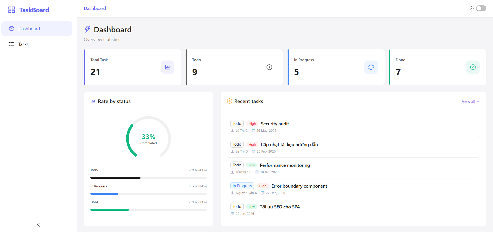
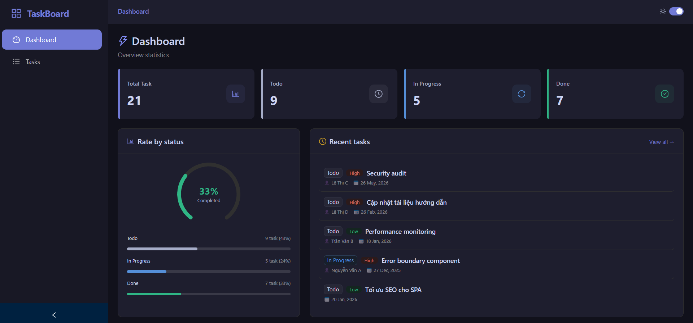
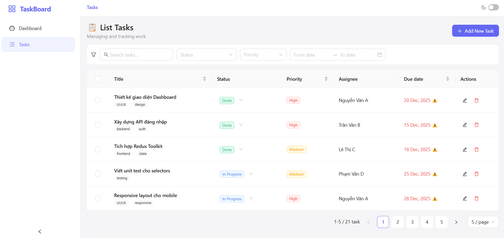
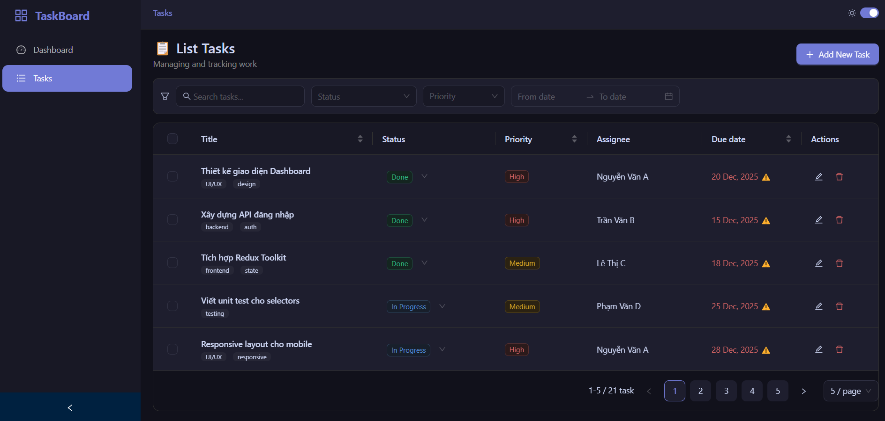
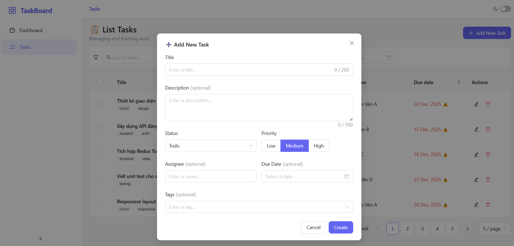
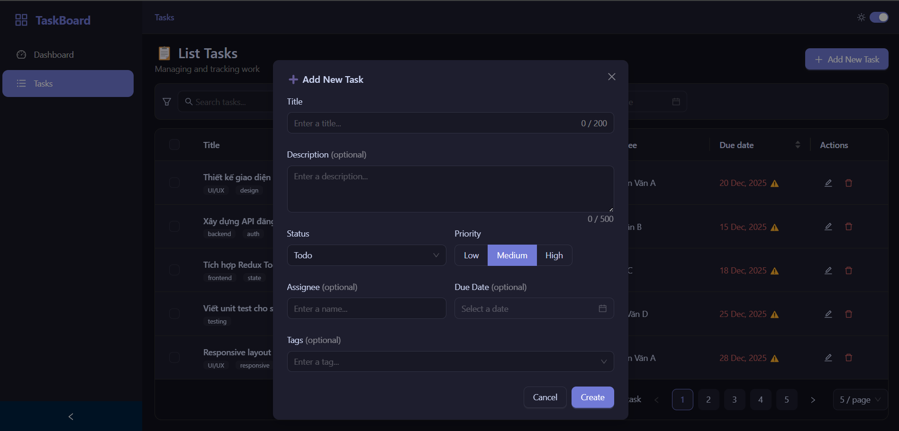

# 🚀 TaskBoard - Professional Internal Task Management

[](https://reactjs.org/)
[](https://ant.design/)
[](https://redux-toolkit.js.org/)
[](https://www.typescriptlang.org/)

TaskBoard là một ứng dụng quản lý công việc nội bộ chuyên nghiệp, được thiết kế với tiêu chuẩn cao về trải nghiệm người dùng (UX) và kiến trúc mã nguồn. Ứng dụng cung cấp các công cụ cần thiết để quản lý dự án hiệu quả, từ việc theo dõi trạng thái đến phân tích hiệu suất qua Dashboard.

---

## 📸 Giao diện Ứng dụng

<p align="center">
  <b>📊 Dashboard Overview (Light/Dark Mode)</b><br>
  <i>Giao diện thống kê trực quan, giúp theo dõi tỷ lệ hoàn thành công việc và trạng thái dự án.</i><br>
  
  
</p>

<br>

<p align="center">
  <b>📝 Quản lý Danh sách Công việc (Light/Dark Mode)</b><br>
  <i>Hệ thống quản lý công việc mạnh mẽ, hỗ trợ chuyển đổi giao diện linh hoạt.</i><br>
  
  
</p>

<br>

<p align="center">
  <b>➕ Thêm mới & Chỉnh sửa</b><br>
  <i>Form nhập liệu chuyên nghiệp với validation và UX mượt mà.</i><br>
  
  
</p>

---

## ✨ Tính năng nổi bật

- **Quản lý Công việc Toàn diện (CRUD):** Thêm, sửa, xóa và thay đổi trạng thái công việc nhanh chóng.
- **Bộ lọc Thông minh (Smart Filters):** Lọc theo Trạng thái (Todo/In Progress/Done), Mức độ ưu tiên (Low/Medium/High) và tìm kiếm theo từ khóa.
- **Phân tích Dữ liệu (Dashboard):** Biểu đồ tròn và các thẻ chỉ số (Cards) giúp nắm bắt nhanh tình hình công việc.
- **Trạng thái URL (URL Sync):** Đồng bộ bộ lọc và trang hiện tại với URL giúp chia sẻ trạng thái ứng dụng dễ dàng.
- **Smart Loading & Skeleton UI:** Trải nghiệm "không giật lag" nhờ hệ thống loading placeholder chuyên nghiệp.
- **Responsive Layout:** Tối ưu hiển thị trên mọi thiết bị: Desktop, Tablet và Mobile.
- **Dark/Light Mode:** Chuyển đổi giao diện linh hoạt, lưu trạng thái vào `localStorage`.

---

## 🛠 Công nghệ Sử dụng

- **Framework:** React 18 (Hooks, Context API)
- **Language:** TypeScript (Strict Mode)
- **UI Framework:** Ant Design 5.x (Custom Theme)
- **State Management:** Redux Toolkit (AsyncThunk, EntityAdapter)
- **Routing:** React Router DOM v7
- **Styling:** Vanilla CSS & Tailwind CSS
- **Testing:** Vitest & React Testing Library
- **Build Tool:** Vite

---

## ⚙️ Hướng dẫn Cài đặt & Chạy

### 1. Yêu cầu hệ thống

- Node.js >= 18.x
- npm >= 9.x

### 2. Cài đặt

```bash
# Clone repository
git clone https://github.com/Stung16/fe-test-kieu-duy-tung.git

# Di chuyển vào thư mục dự án
cd fe-test-kieu-duy-tung

# Cài đặt dependencies
npm install
```

### 3. Khởi chạy

```bash
# Chạy ở chế độ phát triển (localhost:5173)
npm run dev

# Kiểm tra code (Lint & Type check)
npm run validate

# Build sản phẩm cho production
npm run build
```

---

## 📁 Cấu trúc Thư mục

```text
src/
├── assets/          # Mock data và tài nguyên tĩnh
├── components/      # Các component dùng chung (Layout, UI, Breadcrumbs)
├── constants/       # Hằng số, Enum, cấu hình Menu
├── features/        # Các module chức năng chính (Dashboard, Tasks)
├── hooks/           # Custom hooks (useDebounce, useTheme)
├── stores/          # Redux Store, Slices và Thunks
├── types/           # Định nghĩa TypeScript Interfaces
└── utils/           # Helper functions (Formatters, Storage)
```

---

## 📧 Thông tin Liên hệ

- **Tác giả:** Kiều Duy Tùng
- **Email:** kieuduytungdev@gmail.com
